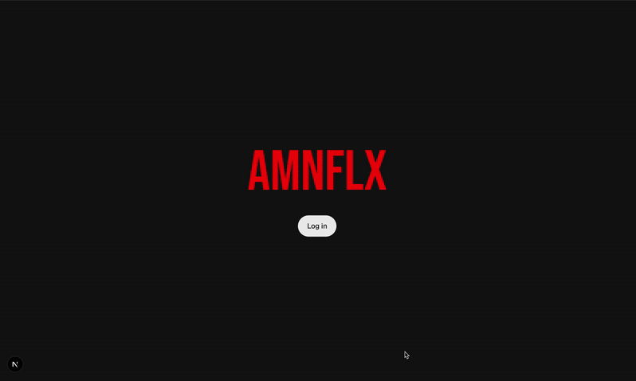

# 🌐 Personal Portfolio — Built with Next.js

Welcome to my personal portfolio project — a work in progress and a hands-on journey into the world of **Next.js**! This site is more than just a place to showcase my work; it's also a sandbox where I’m experimenting, learning, and growing as a developer.

---

## 🚀 About This Project

This project is built from the ground up using **Next.js**, React, and Tailwind CSS. It’s part of my learning journey into modern web development and static site generation (SSG). 

I'm using this opportunity to understand:
- Dynamic routing and API routes in Next.js
- Server-side rendering (SSR) vs static generation
- Tailwind CSS for rapid and responsive UI development
- Performance optimization and accessibility best practices

---

## 🎥 Video Demo

Check out a quick walkthrough of the current progress!

*The demo will be updated as new features are added!*

---

## 🌍 Live Preview

You can view the current version of the portfolio here:

🔗 [Visit My Portfolio](https://amnflx.vercel.app)

> Note: It's still a work in progress — feedback and suggestions are always welcome!

---

## 🛠️ Tech Stack

- [Next.js](https://nextjs.org/)
- [React](https://reactjs.org/)
- [Tailwind CSS](https://tailwindcss.com/)
- [TypeScript](https://www.typescriptlang.org/)
- [Vercel](https://vercel.com/) (for deployment)

---

## 📌 What's Coming Next?

- ✨ Data Science User
- 📱 Fully responsive layout
- 🐛 Accessibility improvements
- 💬 A cool new way to interact with my portfolio

---
